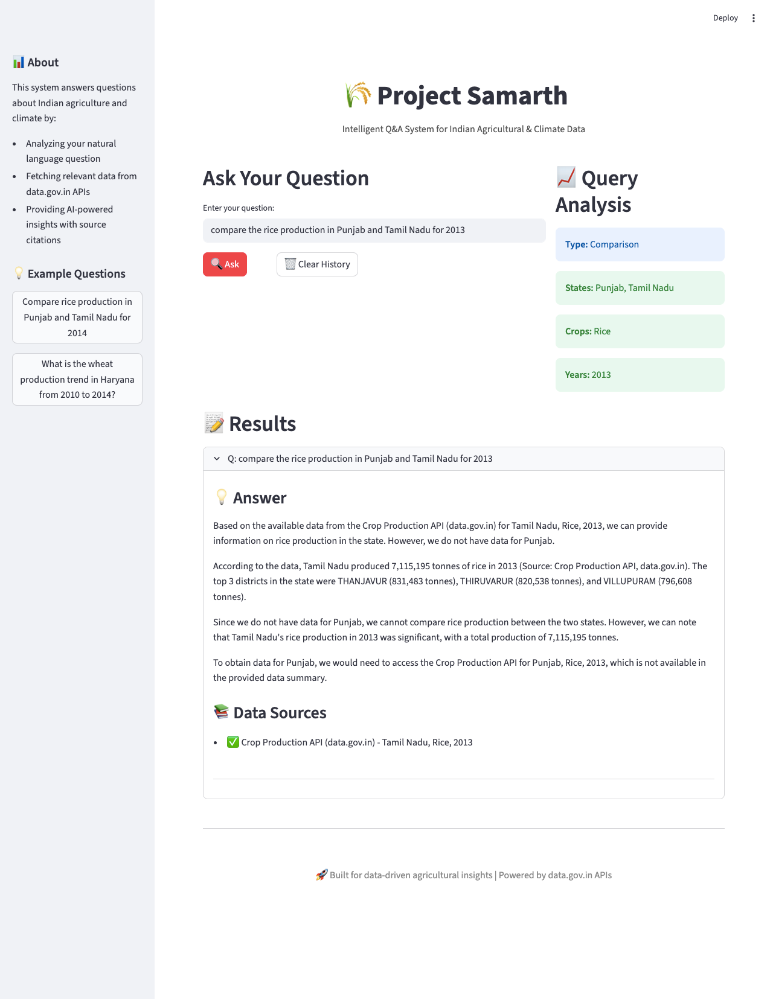

# 🌾 Project Samarth

**Intelligent Q&A System for Indian Agricultural & Climate Data**

## 🎥 Demo Video
**[▶️ Watch 2-Minute Demo on Loom](https://www.loom.com/share/96c8455fcc5b4af5af186af3423eeb66)**



## 🎯 Overview
AI-powered system that answers natural language questions about Indian agriculture and climate using live data from data.gov.in APIs.

## ✨ Key Features
- 🔍 Real-time data fetching from government APIs
- 💬 Natural language query processing
- 🤖 AI-powered answers with source citations
- 📊 Automatic query analysis
- 🎨 Clean web interface

## 📊 Data Sources
- **Crop Production API**: 246,091 records (1997-2014)
  - District-wise, season-wise crop production statistics
- **Daily Rainfall API**: 3.4M+ records (2018-present)
  - District-wise daily rainfall data
- **Source**: data.gov.in

## 🛠️ Tech Stack
- Python 3.11+
- Streamlit (Web Interface)
- Groq AI (Free LLM)
- Pandas (Data Processing)
- data.gov.in REST APIs

## 🚀 Quick Start
```bash
# Clone repository
git clone https://github.com/priyanka7411/project-samarth.git
cd project-samarth

# Install dependencies
pip install -r requirements.txt

# Set up environment
echo "GROQ_API_KEY=your_key_here" > .env

# Run app
streamlit run app.py
```

Get free Groq API key: https://console.groq.com/

## 💡 Example Questions

Try asking:
- "Compare rice production in Punjab and Tamil Nadu for 2013"
- "Show wheat production in Haryana for 2012"
- "What is the rainfall pattern in Kerala for 2020?"
- "Which districts have highest sugarcane production in 2011?"

## 🏗️ System Architecture

### Components:
1. **Query Analyzer** (`query_analyzer.py`)
   - Extracts states, crops, years using pattern matching
   - Identifies query type (comparison, trend, ranking)

2. **Data Handler** (`data_handler.py`)
   - Manages API pagination and rate limiting
   - Fetches from multiple data.gov.in APIs
   - Handles different data formats

3. **AI Engine** (`ai_system.py`)
   - Coordinates data fetching and analysis
   - Uses Groq LLM for natural language generation
   - Ensures all answers cite sources

4. **Web Interface** (`app.py`)
   - Streamlit-based UI
   - Query history management
   - Real-time analysis display
   
```
┌─────────────────┐
│   User Query    │
└────────┬────────┘
         │
         ▼
┌─────────────────┐
│ Query Analyzer  │  ← Extracts states, crops, years
└────────┬────────┘
         │
         ▼
┌─────────────────┐
│  Data Handler   │  ← Fetches from data.gov.in APIs
└────────┬────────┘
         │
         ▼
┌─────────────────┐
│   AI Engine     │  ← Groq LLM generates answer
└────────┬────────┘
         │
         ▼
┌─────────────────┐
│  Answer + Cites │
└─────────────────┘
```

### Data Flow:
```
User Query → Query Analysis → Data Fetching → AI Processing → Answer + Citations
```

## 🎯 Design Decisions

**Real-time API Fetching**
- Ensures data accuracy and freshness
- No local storage needed (better for security)
- Can be deployed in air-gapped environments

**Free Groq API**
- No cost barriers
- Better data sovereignty vs paid services
- Fast inference times

**Source Citations**
- Every answer includes data.gov.in API references
- Builds trust in AI-generated responses
- Enables verification of claims

**Modular Architecture**
- Easy to add new data sources
- Separation of concerns
- Testable components

## 📁 Project Structure
```
project-samarth/
├── app.py                 # Streamlit web interface
├── ai_system.py          # Main AI Q&A system
├── data_handler.py       # API data fetching logic
├── query_analyzer.py     # Query parsing and analysis
├── requirements.txt      # Python dependencies
├── .env                  # Environment variables (gitignored)
├── .gitignore           # Git ignore rules
├── README.md            # This file
└── screenshots/         # App screenshots
```

## 🔒 Security & Privacy
- ✅ No data stored locally
- ✅ API keys secured via environment variables
- ✅ Can be deployed in private/secure environments
- ✅ All data fetched in real-time from government sources
- ✅ No third-party data collection

## 🎬 Links

- **📹 Demo Video**: [Loom Recording](https://www.loom.com/share/96c8455fcc5b4af5af186af3423eeb66)
- **💻 Live Demo**: [Streamlit App](#) *(Add after deployment)*
- **📂 GitHub Repo**: [priyanka7411/project-samarth](https://github.com/priyanka7411/project-samarth)

## 📝 Evaluation Highlights

**Problem Solving & Initiative:**
- Successfully discovered and integrated 2 different data.gov.in APIs
- Handled inconsistent data formats and structures
- Built end-to-end working prototype

**System Architecture:**
- Modular design with clear separation of concerns
- Real-time data integration from multiple sources
- Scalable and extensible architecture

**Accuracy & Traceability:**
- All answers include specific data points
- Every claim cites the source API
- Data fetched directly from government sources

**Core Values:**
- Data sovereignty: Uses free APIs, can be self-hosted
- Privacy: No data storage, secure deployment possible
- Accuracy: Real-time fetching ensures data freshness

## 👩‍💻 Author
**Priyanka** - Built for Project Samarth Challenge

## �� Acknowledgments
- Ministry of Agriculture & Farmers Welfare
- India Meteorological Department (IMD)
- data.gov.in for open data APIs

---
**🌾 Built for data-driven agricultural insights | Powered by data.gov.in APIs**
